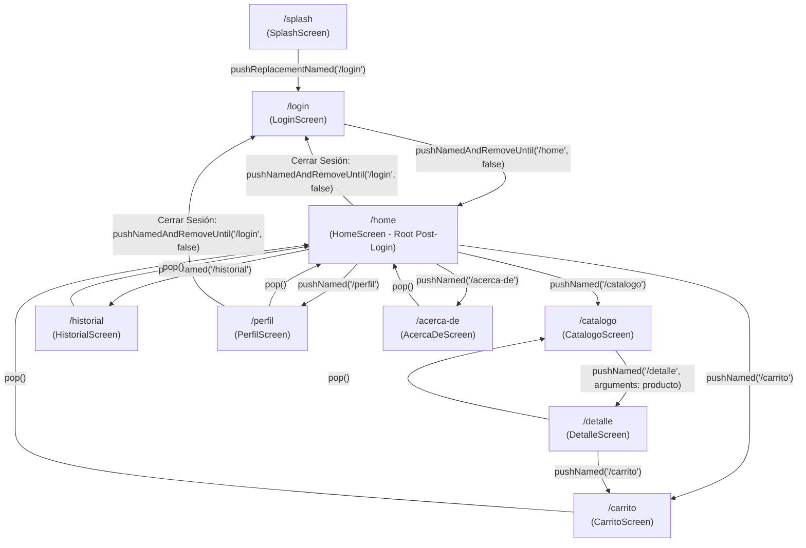

# Documento de Análisis de Layouts, Navegación y Diseño Responsive
## Proyecto: OrderTracker — Impresos Bethel

---

### Portada y Datos Generales

| Campo | Detalle |
| :--- | :--- |
| **Proyecto** | **OrderTracker** (Sistema de Seguimiento de Pedidos y Catálogo) |
| **Empresa / Caso** | **Impresos Bethel** (Imprenta, Serigrafía, Bordado y Artículos de Librería) |
| **Asignatura** | Desarrollo de Aplicaciones Móviles |
| **Actividad** | Actividad 4.2 — Layouts, Rutas con Nombre y Responsive |
| **Integrantes del Equipo** | • Yerson Alvarenga<br>• Gabriel Escalante<br>• Fernando Arvizu |
| **Fecha de Entrega** | 16 de Agosto de 2026 |

---

## 1. Inventario de Pantallas

A continuación se detalla el inventario completo de las 9 pantallas que conforman la aplicación **OrderTracker**, especificando el layout principal seleccionado y su correspondiente justificación técnica y de experiencia de usuario (UX).

| # | Pantalla | Ruta (`Named Route`) | Layout Principal | Justificación Técnica y de UX |
| :-: | :--- | :--- | :--- | :--- |
| **1** | **Splash Screen** | `/splash` | `Stack` + `Center` + `Column` con animación de desvanecimiento (`FadeTransition`) | Pantalla de carga inicial ligera y atractiva para presentar el branding de Impresos Bethel. No requiere scroll y centra el logotipo y spinner antes de redirigir a `/login`. |
| **2** | **Login / Registro** | `/login` | `SingleChildScrollView` con `Form` y `Column` (`crossAxisAlignment: stretch`) | Formulario de autenticación que debe adaptarse a cualquier altura de dispositivo y evitar desbordamientos visuales (*overflow*) cuando el teclado virtual del sistema operativo se despliega. |
| **3** | **Home / Dashboard** | `/home` | `Drawer` + `IndexedStack` + `SingleChildScrollView` con `Column` | Estructura modular tipo Dashboard. Muestra métricas clave (KPIs), accesos directos y widgets de estado arriba, permitiendo navegación fluida mediante `BottomNavigationBar` sin perder el estado de cada vista. |
| **4** | **Catálogo de Productos** | `/catalogo` | `Column` con barra de búsqueda (`TextField`), selector de categorías horizontal (`ListView` de `ChoiceChip`) y `GridView.builder` | Los productos de imprenta y papelería requieren mayor impacto visual en cuadrícula. `GridView.builder` implementa renderizado perezoso (*lazy loading*), renderizando en memoria únicamente los elementos visibles en el viewport. |
| **5** | **Detalle de Producto** | `/detalle` | `SingleChildScrollView` con `Column` y botón de acción fijo (`ElevatedButton`) | Vista con información extensa (imagen representativa, categoría, precio en Lempiras, descripción completa y selector de personalización). El scroll vertical asegura legibilidad total en pantallas de cualquier resolución. |
| **6** | **Carrito y Resumen** | `/carrito` | `Column` con `Expanded(ListView.builder)` + `Container` inferior fijo | Layout estándar de comercio electrónico: los artículos seleccionados son scrolleables dinámicamente en el área expandida, mientras que el desglose de totales (Subtotal, ISV 15%, Total) y el botón de confirmar pedido permanecen siempre anclados y visibles en la parte inferior. |
| **7** | **Historial de Pedidos** | `/historial` | `ListView.separated` (`ListView.builder` con separadores visuales) | Estructura lineal y cronológica óptima para listados extensos de órdenes (#BET-1001, #BET-1002...). `ListView.separated` optimiza el reciclaje de celdas en memoria e inserta divisores limpios entre registros. |
| **8** | **Perfil y Configuración** | `/perfil` | `ListView` con `Card` y `ListTile` agrupados temáticamente | Interfaz tipo *Settings* (Ajustes de cuenta, preferencias de notificación, modo oscuro, seguridad). El uso de `Card` con `ListTile` (`leading`, `title`, `subtitle`, `trailing`) brinda jerarquía visual limpia y consistente. |
| **9** | **Acerca de** | `/acerca-de` | `SingleChildScrollView` con `Column` y `Card` | Pantalla informativa estática con la misión de la empresa, datos de contacto y créditos del equipo de desarrollo. |

---

## 2. Mapa de Navegación

### 2.1 Diagrama de Flujo (Mermaid)



### 2.2 Especificación de Rutas y Transiciones

1. **Raíz Post-Login**:
   - La pantalla `/home` es la pantalla raíz de la aplicación una vez autenticado el usuario.
   - Al iniciar sesión con éxito desde `/login`, se ejecuta:
     ```dart
     Navigator.pushNamedAndRemoveUntil(context, '/home', (route) => false);
     ```
     Esto elimina todas las pantallas previas de la pila de navegación, garantizando que al presionar el botón "Atrás" del dispositivo el usuario no regrese a la pantalla de Login.

2. **Paso de Argumentos Tipados**:
   - Al seleccionar cualquier producto en el Catálogo, se envían sus datos mediante:
     ```dart
     Navigator.pushNamed(context, '/detalle', arguments: producto);
     ```
   - En `/detalle`, la pantalla extrae el argumento fuertemente tipado:
     ```dart
     final producto = ModalRoute.of(context)!.settings.arguments as Producto;
     ```

3. **Puntos de Retorno**:
   - Las pantallas secundarias (`/detalle`, `/carrito`, `/historial`, `/acerca-de`) utilizan el botón de retroceso de la `AppBar` (`Navigator.pop(context)`), devolviendo al usuario exactamente a la vista precedente con su estado preservado.

4. **Cierre de Sesión Seguro**:
   - Desde el Drawer o desde la pantalla de Perfil, la acción "Cerrar Sesión" ejecuta `Navigator.pushNamedAndRemoveUntil(context, '/login', (route) => false)`, restableciendo la pila limpia de navegación.

---

## 3. Decisiones de Diseño Técnico

### Decisión 1: GridView.builder con Columnas Adaptativas (Responsive Design)
* **Problema**: Los productos de imprenta (talonarios, camisetas, bordados, stickers) cuentan con iconos y fotografías que lucen desproporcionados en una lista vertical simple o en pantallas grandes (tablets/monitores) si tienen un número fijo de columnas.
* **Solución Técnica**: Implementar `GridView.builder` con `crossAxisCount` dinámico evaluado mediante `MediaQuery`:
  ```dart
  crossAxisCount: MediaQuery.of(context).size.width > 600 ? 3 : 2,
  childAspectRatio: MediaQuery.of(context).size.width > 600 ? 0.95 : 0.82,
  ```
* **Justificación**: Proporciona una experiencia de usuario responsiva donde en teléfonos móviles compactos se aprecian 2 columnas cómodas y legibles, mientras que en tablets o modo horizontal se expande a 3 columnas automáticamente sin distorsionar las tarjetas. Además, `.builder` garantiza un consumo óptimo de memoria al reciclar widgets que salen del viewport.

---

### Decisión 2: Centralización Estricta de Rutas con Nombre y Paso de Argumentos Desacoplado
* **Problema**: El uso de `Navigator.push(MaterialPageRoute(builder: (ctx) => ...))` disperso en múltiples archivos genera un fuerte acoplamiento entre pantallas, dificulta el mantenimiento y complica la integración futura con deep linking y APIs.
* **Solución Técnica**: Centralizar la tabla de rutas en `lib/main.dart` mediante el mapa `routes` y gestionar los parámetros a través del objeto `RouteSettings` y `ModalRoute.of(context)!.settings.arguments`.
* **Justificación**: Facilita la refactorización, estandariza los nombres de las pantallas (`/splash`, `/login`, `/home`, `/catalogo`, `/detalle`, `/carrito`, `/historial`, `/perfil`, `/acerca-de`) y permite cambiar el flujo de navegación desde un único punto central de configuración.

---

### Decisión 3: Arquitectura Column + Expanded(ListView) + Footer Fijo para Carrito y Checkout
* **Problema**: En pantallas de compra o carrito de pedidos, cuando la lista contiene múltiples artículos y se coloca todo dentro de un `SingleChildScrollView`, el botón de acción principal ("Confirmar Pedido") queda oculto al final de la página, obligando al usuario a desplazarse todo el documento para ver el total y pagar.
* **Solución Técnica**: Emplear una `Column` principal con un widget `Expanded(child: ListView.builder(...))` para el listado scrolleable de artículos, seguido de un `Container` con elevación y sombras en la parte inferior conteniendo el resumen financiero y el botón principal.
* **Justificación**: Sigue las mejores directrices de diseño de interfaces e-commerce móviles (Human Interface Guidelines y Material Design 3), asegurando que el total a pagar y la acción de compra siempre estén accesibles de forma inmediata con un solo tap.

---

### Decisión 4: Búsqueda Reactiva en Tiempo Real y Filtrado por ChoiceChips
* **Problema**: Al navegar por un catálogo con diversas categorías (Talonarios, Serigrafía, Bordados, Librería, Stickers), los usuarios necesitan encontrar productos rápidamente sin recargar la pantalla.
* **Solución Técnica**: Implementar un `StatefulWidget` en `CatalogoScreen` que combina una barra de búsqueda `TextField` con listener reactivo `onChanged` y una fila horizontal de `ChoiceChip`s de categorías, filtrando la lista en memoria mediante predicados Dart `.where()`.
* **Justificación**: Brinda una respuesta inmediata con 0 latencia y feedback visual instantáneo (mostrando un estado vacío amigable con icono y sugerencia cuando no hay coincidencias).

---

## 4. Conclusión

La arquitectura implementada en esta Semana 4 proporciona a **OrderTracker (Impresos Bethel)** una base sólida, modular y escalable. Todas las pantallas cuentan con layouts especializados según su caso de uso, navegación predecible y protegida con rutas nombradas, datos ficticios altamente representativos y comportamiento responsivo, dejando el proyecto completamente listo para la conexión con el backend y API REST en la Semana 5.
